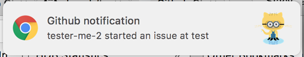
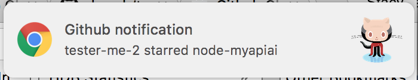

Github Chrome Notifier sends you chrome notifications whenever events on your Github repository are triggered.

  

	<h3>What super powers does <b>Github Chrome Notifier</b> currently have?</h3>

	[X] Informs you when a user stars your repository  

	[X] Informs you when a user starts an issue  

	[X] Informs you when a user comments on an issue  

	[X] Informs you when a user forks your repository  

	[X] Informs you when a user creates a pull request  
	

